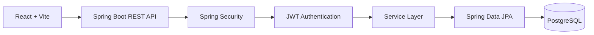
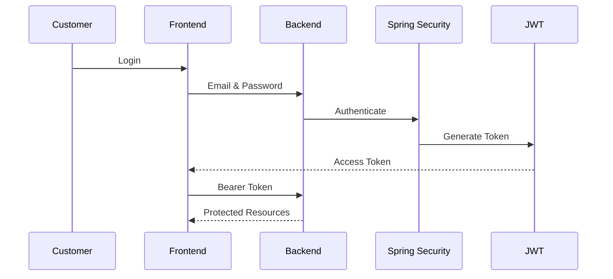
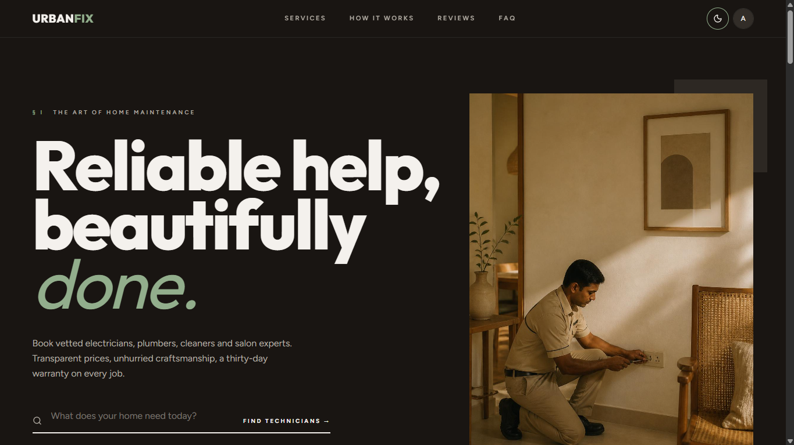
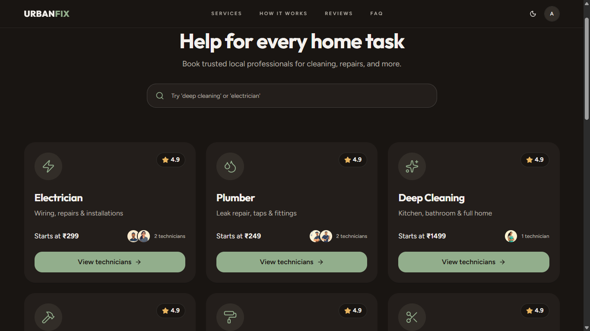
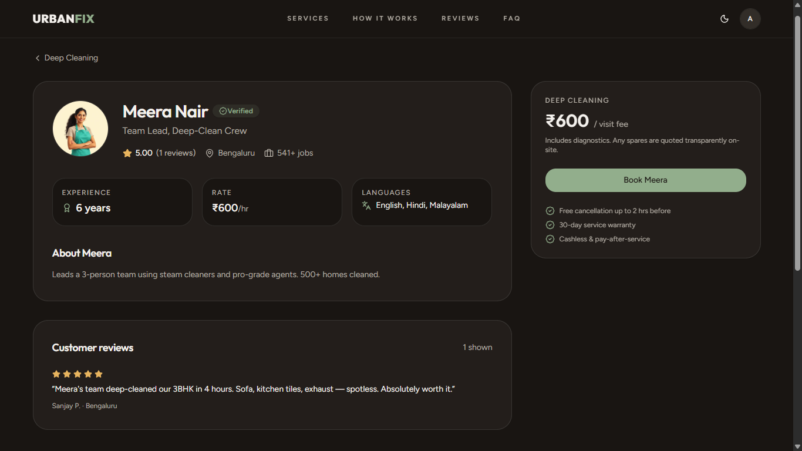
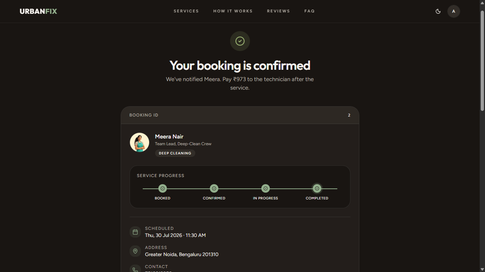
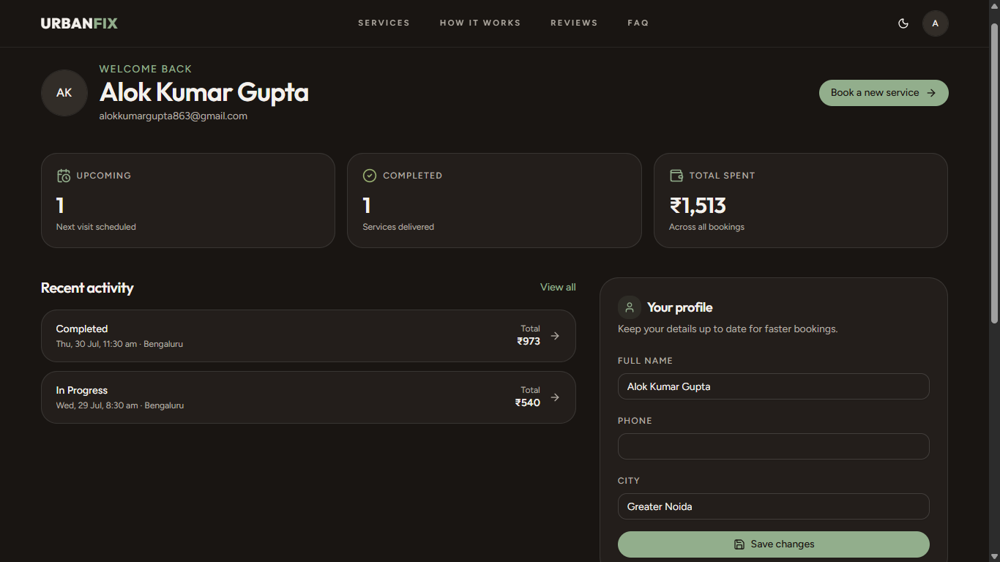
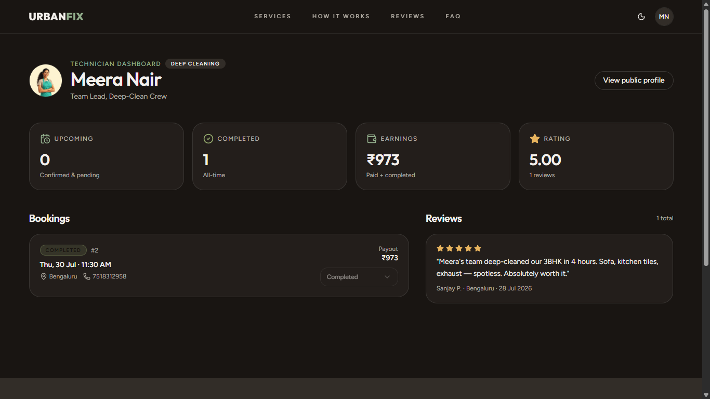
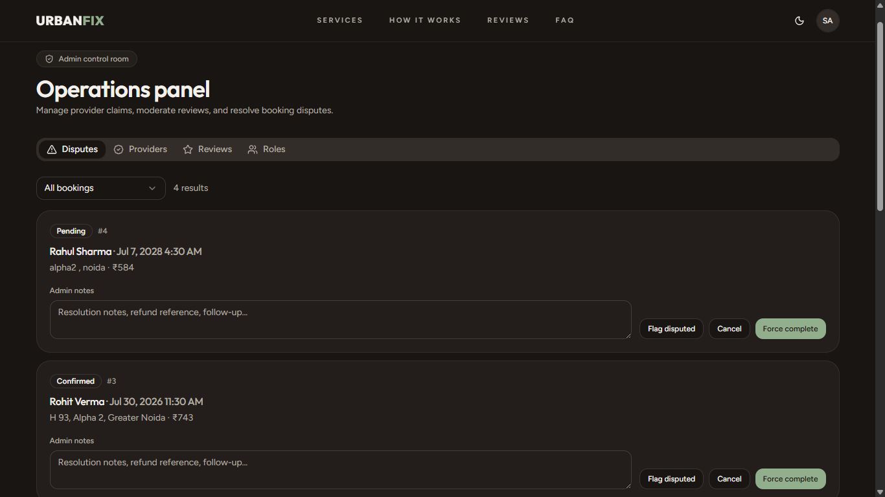

<div align="center">


# UrbanFix

### Professional Home Service Booking Platform

Book trusted home service professionals including electricians, plumbers, AC technicians, carpenters, painters, cleaners, salon experts and more through a secure, modern and user-friendly platform.

<p>


</p>

### 🌐 Live Demo

**Frontend:** https://urbanfix-peach.vercel.app/

**Backend API:** https://urbanfix-9il0.onrender.com

</div>

---

# 📖 Overview

UrbanFix is a full-stack home service booking platform.

The platform connects customers with verified service professionals while providing secure booking, online payments, booking management, reviews, and role-based dashboards.

The application follows a scalable client-server architecture using React for the frontend and Spring Boot for the backend with JWT authentication and PostgreSQL as the database.

---

# ✨ Features

## 👤 Customer

- User Registration & Login
- JWT Authentication
- Browse Service Categories
- View Professional Profiles
- Book Home Services
- Secure Razorpay Payments
- Booking History
- Rate & Review Providers
- Profile Management

---

## 👨‍🔧 Provider

- Provider Login
- Provider Dashboard
- Manage Bookings
- Update Booking Status
- View Customer Reviews
- Profile Management

---

## 👨‍💼 Admin

- Admin Dashboard
- Manage Categories
- Manage Providers
- Manage Customers
- Monitor Bookings
- Platform Analytics

---

## 🔐 Security

- Spring Security
- JWT Authentication
- BCrypt Password Encryption
- Role-Based Authorization
- Secure REST APIs
- Razorpay Signature Verification

---

# 🏗️ System Architecture



---

# 🛠 Tech Stack

| Layer | Technology |
|---------|------------|
| Frontend | React 19 |
| UI | Tailwind CSS + shadcn/ui |
| Backend | Spring Boot 3 |
| Language | Java 17 |
| Security | Spring Security |
| Authentication | JWT |
| ORM | Hibernate / Spring Data JPA |
| Database | PostgreSQL (Neon) |
| Payments | Razorpay |
| Build Tool | Maven |
| Deployment | Vercel + Render |

---

# 📂 Project Structure

```
UrbanFix
│
├── frontend
│   ├── src
│   ├── assets
│   ├── components
│   ├── context
│   ├── hooks
│   ├── pages
│   ├── services
│   └── utils
│
├── backend
│   ├── config
│   ├── controller
│   ├── dto
│   ├── entity
│   ├── repository
│   ├── security
│   ├── service
│   ├── exception
│   └── util
│
└── README.md
```

---

# 🔐 Authentication Flow



---

# 🗄 Database

### Main Tables

- users
- user_roles
- profiles
- providers
- service_categories
- bookings
- reviews

---

# 🔌 REST API

## Authentication

| Method | Endpoint |
|----------|-----------|
| POST | /api/auth/register |
| POST | /api/auth/login |
| GET | /api/auth/me |

---

## Categories

| Method | Endpoint |
|----------|-----------|
| GET | /api/categories |

---

## Providers

| Method | Endpoint |
|----------|-----------|
| GET | /api/providers |
| GET | /api/providers/{id} |

---

## Bookings

| Method | Endpoint |
|----------|-----------|
| POST | /api/bookings |
| GET | /api/bookings |
| PUT | /api/bookings/{id} |

---

## Payments

| Method | Endpoint |
|----------|-----------|
| POST | /api/payments/create-order |
| POST | /api/payments/verify |

---

# 🚀 Local Installation

## Clone Repository

```bash
git clone https://github.com/alokkgupta28/urbanfix.git

cd urbanfix
```

---

## Backend

```bash
cd backend

mvn clean install

mvn spring-boot:run
```

### Backend Environment Variables

```
DATABASE_URL

DATABASE_USERNAME

DATABASE_PASSWORD

JWT_SECRET

RAZORPAY_KEY_ID

RAZORPAY_KEY_SECRET
```

---

## Frontend

```bash
npm install

npm run dev
```

### Frontend Environment Variables

```
VITE_API_URL=http://localhost:8080/api

VITE_RAZORPAY_KEY_ID=rzp_test_xxxxxxxxx
```

---

# 🌍 Deployment

| Service | Platform |
|----------|----------|
| Frontend | Vercel |
| Backend | Render |
| Database | Neon PostgreSQL |
| Payments | Razorpay |

---

# 📷 Screenshots

## Home Page



---

## Categories



---

## Provider Details



---

## Booking



---

## Customer Dashboard



---

## Provider Dashboard



---

## Admin Dashboard



---

# 🔒 Security Features

- JWT Authentication
- BCrypt Password Hashing
- Spring Security
- Stateless Authentication
- Role-Based Authorization
- Protected REST APIs
- Secure Payment Verification
- Exception Handling
- Input Validation

---

# 🚀 Performance

- Responsive Design
- Optimized REST APIs
- Fast Page Loading
- React Query Caching
- Lazy Loading
- Stateless Authentication

---

# 🔮 Future Enhancements

- Google Authentication
- Email Verification
- OTP Login
- Live Booking Tracking
- Push Notifications
- AI Service Recommendation
- Chat Support
- Mobile Application

---

# 👨‍💻 Author

## Alok Kumar Gupta

**B.Tech Computer Science & Engineering**

Noida Institute of Engineering & Technology

**Portfolio**

https://alokgupta.dev

**LinkedIn**

https://linkedin.com/in/alokkgupta28

**GitHub**

https://github.com/alokkgupta28

---

# ⭐ Support

If you found this project helpful, please consider giving it a **⭐ Star** on GitHub.

It helps the project gain visibility and motivates further improvements.

---

# 📄 License

This project is licensed under the MIT License.

Feel free to use it for learning and educational purposes.

---

<div align="center">

Made with ❤️ by **Alok Kumar Gupta**

</div>
